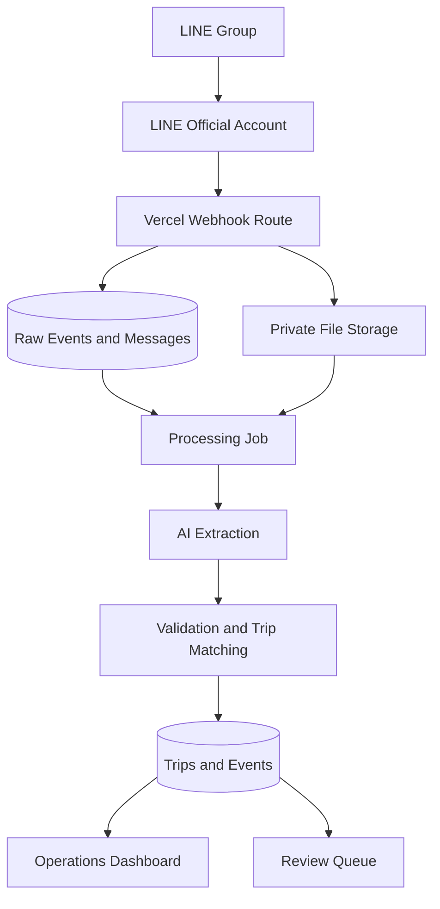

# Product Requirements Document: LINE Trip Intelligence

**Working name:** LINE Trip Intelligence  
**Product owner:** GEOID (Thailand) Co., Ltd.  
**Document status:** Implemented — pilot-ready; living document  
**Version:** 1.1  
**Date:** 19 July 2026 (last reconciled with the build: 20 July 2026)  
**Primary deployment:** Vercel via GitHub  
**Primary database:** Supabase PostgreSQL

---

## Implementation status (as of 20 July 2026)

This PRD is the original spec. The application has since been built and wired to
live data; this banner records what is real and where the implementation
deliberately diverges from the spec. Section-level notes below the banner defer to
this summary where they conflict.

**Built and working end to end:**

- **Ingestion (§10.1–10.2):** LINE webhook with HMAC-SHA256 signature verification,
  idempotent message/attachment storage, attachment retrieval into a private
  Supabase Storage bucket. Attachments are viewable in the inbox via short-lived,
  org-scoped signed URLs (opened in a new tab).
- **AI + trip engine (§10.3–10.8, §16):** versioned Zod extraction contract, an
  OpenRouter extractor, deterministic normalizers/matcher/status-engine, trip
  create/update, conversation + trip summaries, and a working review queue with
  Accept (applies the extraction) and Dismiss.
- **Operations UI (§11):** dashboard, trips table, trip detail + journey rail,
  message inbox, and review queue all read live Supabase data through `lib/data/*`.
- **Auth & tenancy (§6, §13):** Supabase Auth with **Google OAuth + email magic
  link**, allowlist-gated profile provisioning, and org-scoped RLS.
- **Data model (§12):** all tables from §12 exist (migrations `0001`–`0011`).
- **Tests (§19.1):** 36 Vitest unit tests (confidence, normalizers, status-engine,
  webhook signature, matcher).

**Deliberate divergences from the spec:**

- **AI is manually triggered, not automatic.** Extraction runs only on an explicit
  action — **Run AI** (per message), **Re-summarise** (per trip), **Accept/Dismiss**
  (review queue). A pg_cron/pg_net scheduler exists (migration `0011`) but is left
  **UNSCHEDULED** by choice.
- **AI provider is OpenRouter with `moonshotai/kimi-k3`**, not OpenAI. The
  `TripExtractor` provider abstraction (§16.4) is honored by `OpenRouterExtractor`.
- **Matcher composite rule tightened (§10.5):** the composite (date + destination)
  fallback runs **only when the message has no usable shipment code**. A clear code
  that matches no existing trip creates its own trip instead of probable-matching a
  differently-coded one.
- **UI libraries:** hand-built components in `components/ui/*` — **no shadcn/ui and
  no TanStack Table** (§7). Supabase **Realtime** and **Playwright** are not yet used.

**Not yet done:** review actions Link-to-trip / Reprocess (display only), Settings
depth, and Phase 4 hardening (RLS/load tests, monitoring/alerts, AI regression set,
retention config, pilot).

---

## 1. Executive summary

LINE Trip Intelligence is a mobile-responsive web application that captures new conversations from authorized LINE groups through a LINE Official Account (LINE OA), preserves text and attachments, summarizes operational conversations, and converts transport-related messages into structured trip records.

The application must identify trip assignments and subsequent status updates in Thai, English, or mixed-language messages. It must consolidate repeated messages into one trip, using the shipment code as the primary business key, and maintain a chronological event history for each trip.

The system is an operational support tool, not a fully autonomous transport management system. AI may propose structured information, but deterministic rules and human review must control record creation, matching, conflict resolution, and final confirmation.

---

## 2. Problem statement

Transport operations are coordinated inside LINE groups. Information about assignments, trucks, trailers, drivers, containers, origins, destinations, planned delivery times, border releases, arrival, loading, and unloading is posted as free text, photographs, screenshots, and files.

The current process creates the following problems:

- Important information is buried in long conversations.
- The same assignment is reposted when its status changes.
- Staff must manually identify the current status of each truck.
- Photos and files are difficult to connect to the correct trip.
- There is no reliable trip table or event timeline.
- Operational reports require manual consolidation.
- Errors may occur when dates, truck registrations, or destinations are copied manually.

---

## 3. Product vision

Convert informal LINE transport conversations into a traceable, searchable, and reviewable operational trip database without forcing drivers and coordinators to change their normal LINE workflow.

### 3.1 Product principles

1. **Preserve the evidence:** Store the original webhook payload, message, sender, timestamp, and attachment before AI processing.
2. **One trip, many updates:** Reposted assignments and status changes must update one trip and append events, not create duplicate trips.
3. **Human control:** Low-confidence or conflicting results must enter a review queue.
4. **AI proposes; rules decide:** AI extracts meaning. Application logic performs matching, validation, and database writes.
5. **Mobile first:** Dispatchers must be able to review trips from a phone.
6. **Auditability:** Every automatic and manual change must be traceable.
7. **Privacy by design:** Only authorized groups and users may be processed or viewed.

---

## 4. Goals and success metrics

### 4.1 MVP goals

- Capture all supported new LINE messages from registered groups.
- Store text, image, and file messages with source metadata.
- Extract trip assignments and trip status events.
- Consolidate repeated updates by shipment code.
- Display trips in a searchable operational table.
- Display a chronological trip timeline with source messages and attachments.
- Provide manual review, correction, confirmation, and audit history.
- Export filtered trips to CSV.
- Deploy automatically from GitHub to Vercel.

### 4.2 Initial success metrics

| Metric | MVP target |
|---|---:|
| Supported webhook events saved | 99% or higher |
| Duplicate webhook events creating duplicate records | 0% |
| Trips with shipment codes matched correctly | 95% or higher |
| Required trip fields extracted correctly on the test dataset | 90% or higher |
| Messages available in dashboard after receipt | Under 10 seconds, excluding large files |
| Normal text messages processed by AI | Under 60 seconds |
| Unreviewed low-confidence changes applied to confirmed fields | 0 |

Accuracy targets must be measured against a manually labelled test set, including the supplied sample conversation.

---

## 5. Non-goals for MVP

- Capturing LINE messages sent before the LINE OA joined a group.
- Replacing Wialon, Tracksolid, ERP, accounting, or a complete TMS.
- GPS position tracking or automatic geofence events.
- Native iOS or Android applications.
- Automatic billing, customer invoicing, or driver payment.
- Reading LINE Notes or Albums unless a future LINE API capability explicitly supports the requirement.
- Fully autonomous correction of conflicting confirmed trip information.
- Perfect extraction from every handwritten or poor-quality image.
- Sending operational commands to drivers without an authorized user action.

---

## 6. Users and roles

### 6.1 User roles

| Role | Main permissions |
|---|---|
| System administrator | Manage organizations, groups, users, settings, retention, and integrations |
| Operations manager | View all trips, confirm/correct data, export reports, manage master data |
| Dispatcher | View and edit assigned trips, process review queue, add notes and events |
| Viewer | Read trips, summaries, timelines, and attachments |
| Integration service | Receive webhooks and run approved background processing; no interactive login |

### 6.2 Multi-tenancy

Every operational table must include `organization_id`. Supabase Row Level Security (RLS) must prevent users from accessing another organization. MVP may launch with one organization, but the schema must not require a future multi-tenancy migration.

---

## 7. Recommended technology stack

The "Actual" column records what shipped; blank means the recommendation was kept.

| Layer | Recommended | Actual |
|---|---|---|
| Web framework | Next.js App Router with TypeScript | Next.js 15.5.x, React 19 |
| UI | Tailwind CSS and shadcn/ui | Tailwind v3.4 + **hand-built `components/ui/*`** (no shadcn) |
| Data table | TanStack Table | **Custom table** in `components/trips/*` (no TanStack) |
| Forms and validation | React Hook Form and Zod | Zod (forms are minimal so far) |
| Server state | Server Components + TanStack Query for client data | **Server Components + Server Actions** (no TanStack Query) |
| Database | Supabase PostgreSQL | ✓ |
| Authentication | Supabase Auth | ✓ — **Google OAuth + email magic link**, allowlist-gated |
| Authorization | Supabase RLS plus application role checks | ✓ |
| Attachments | Private Supabase Storage buckets | ✓ — bucket `attachments`; viewed via signed URLs |
| Realtime | Supabase Realtime for trip and review updates | **Not yet** (pages are `force-dynamic`; `revalidatePath` after actions) |
| LINE integration | LINE Messaging API webhook and content endpoints | ✓ |
| AI | Provider adapter with OpenAI Structured Outputs | **OpenRouter `moonshotai/kimi-k3`** via the `TripExtractor` adapter |
| Hosting | Vercel | ✓ (Hobby; 60s function cap) |
| Source control and CI | GitHub and GitHub Actions | GitHub ✓; Actions **not yet** |
| Testing | Vitest, React Testing Library, and Playwright | **Vitest** ✓; RTL/Playwright **not yet** |
| Monitoring | App/Vercel/Supabase logs, optional Sentry | Platform logs; Sentry **not yet** |

### 7.1 Architecture decision

Use a modular monolith for MVP. Keep the frontend, authenticated APIs, and LINE webhook route in one Next.js repository. Keep Supabase migrations and server-side processing modules in the same repository. Do not introduce microservices until processing volume or reliability data justifies them.

---

## 8. High-level architecture



### 8.1 Processing separation

The webhook request must complete quickly. It must not wait for AI extraction.

Synchronous webhook responsibilities:

1. Read the raw request body without modification.
2. Verify the `x-line-signature` using the LINE channel secret.
3. Parse and validate the webhook envelope.
4. Upsert the webhook using `webhookEventId` for idempotency.
5. Save supported message metadata.
6. Download ephemeral LINE content or enqueue its immediate retrieval.
7. Create a processing job.
8. Return a successful HTTP response.

Asynchronous responsibilities:

1. Normalize text and OCR/inspect supported attachments.
2. Classify operational relevance.
3. Extract structured trip and event data.
4. Validate formats and required fields.
5. Match the extraction to a trip.
6. Create a proposed change, automatically apply a safe change, or send it to review.
7. Update summaries and notify the dashboard.

The exact queue mechanism may use a Supabase-native queue or a managed workflow/queue compatible with Vercel. The queue implementation must support retry, idempotency, failure visibility, and dead-letter handling. It must not depend on an in-memory process.

---

## 9. Core user journeys

### 9.1 Connect a LINE group

1. Administrator creates a LINE OA Messaging API channel.
2. Administrator enables webhook use and permits the bot to join group chats.
3. Administrator configures the production webhook URL.
4. A group member invites the LINE OA to the approved group.
5. The system receives a join event and registers the group as `pending`.
6. Administrator maps the LINE group to an organization and activates capture.
7. New messages are captured from that point forward.

### 9.2 Create a trip from an assignment

1. Coordinator posts an assignment in LINE.
2. The webhook stores the original message.
3. AI classifies it as `trip_assignment` and extracts structured fields.
4. Matching logic checks for an existing shipment.
5. If no match exists and minimum conditions are satisfied, the system creates a draft trip.
6. If confidence is low or required data conflicts, the system creates a review item.
7. The dashboard displays the trip and links it to the source message.

### 9.3 Update an existing trip

1. A driver or coordinator reposts the assignment with an appended status.
2. AI extracts the same shipment code plus one or more new events.
3. The system matches the existing trip.
4. New events are appended if their idempotency keys are new.
5. Existing confirmed fields are not overwritten silently.
6. The latest status is recalculated from the event timeline.

### 9.4 Associate photos or files

1. A member sends photos or files shortly after a trip message.
2. The system downloads the content and saves it privately.
3. It attempts to associate the attachment using explicit shipment information first.
4. If no explicit reference exists, it uses group, sender, quoted message, time proximity, and preceding message context.
5. Low-confidence associations enter the review queue.

### 9.5 Review and correct AI output

1. Dispatcher opens a review item.
2. The screen shows the source message, attachments, proposed values, existing values, and confidence.
3. Dispatcher accepts, edits, rejects, or links the message to another trip.
4. The application records the actor, timestamp, old value, new value, and reason.

---

## 10. Functional requirements

### 10.1 LINE webhook ingestion

| ID | Requirement |
|---|---|
| FR-LINE-001 | Provide `POST /api/webhooks/line` over HTTPS. |
| FR-LINE-002 | Verify every webhook signature before parsing trusted data. |
| FR-LINE-003 | Reject invalid signatures without creating operational data. |
| FR-LINE-004 | Store `webhookEventId` with a unique constraint. |
| FR-LINE-005 | Preserve the original event JSON for audit and replay. |
| FR-LINE-006 | Store LINE timestamp, receipt timestamp, group ID, user ID, message ID, type, quoted message ID, and redelivery status when supplied. |
| FR-LINE-007 | Support text, image, file, video, audio, location, sticker, join, leave, member join, member leave, edit, and unsend events as metadata; MVP extraction is required for text, image, file, and location. |
| FR-LINE-008 | Activate processing only for approved LINE groups. Unknown groups must be quarantined or ignored according to configuration. |
| FR-LINE-009 | Retrieve LINE profile and group summary where permitted and cache display metadata. |
| FR-LINE-010 | Record processing status as `received`, `stored`, `queued`, `processing`, `processed`, `review_required`, or `failed`. |
| FR-LINE-011 | Support safe replay of failed events without duplicating trips or timeline events. |
| FR-LINE-012 | When an unsend event is received, mark the source message unavailable and apply the configured deletion/redaction policy. |

### 10.2 Attachment handling

| ID | Requirement |
|---|---|
| FR-ATT-001 | Retrieve supported LINE content promptly using the message ID. |
| FR-ATT-002 | Store files in a private Supabase Storage bucket. |
| FR-ATT-003 | Record original filename, detected MIME type, size, checksum, storage path, and retrieval status. |
| FR-ATT-004 | Enforce configurable file-size and allowed-type limits. |
| FR-ATT-005 | Never execute uploaded content. |
| FR-ATT-006 | Generate thumbnails where supported. |
| FR-ATT-007 | Use signed, short-lived URLs for authorized viewing. |
| FR-ATT-008 | Extract text from supported PDF and image content when useful. |
| FR-ATT-009 | Keep attachment-to-trip relationships editable and auditable. |

### 10.3 Classification and extraction

Each message or context window must be classified into one of the following:

- `trip_assignment`
- `trip_update`
- `trip_correction`
- `trip_cancellation`
- `attachment_context`
- `general_operational_notice`
- `non_operational`
- `unknown`

The AI extraction contract must return JSON validated by Zod. It must never directly execute SQL or produce database identifiers.

Required extraction fields:

```ts
type TripExtraction = {
  classification:
    | "trip_assignment"
    | "trip_update"
    | "trip_correction"
    | "trip_cancellation"
    | "attachment_context"
    | "general_operational_notice"
    | "non_operational"
    | "unknown";
  language: string[];
  shipmentCode: string | null;
  assignmentDate: string | null; // ISO date
  tractorRegistration: string | null;
  trailerRegistration: string | null;
  truckBrand: string | null;
  carrierCode: string | null;
  driverNameThai: string | null;
  driverNameEnglish: string | null;
  driverPhone: string | null;
  originName: string | null;
  destinationName: string | null;
  destinationProvince: string | null;
  destinationMapUrl: string | null;
  plannedDeliveryAt: string | null; // ISO timestamp with timezone
  loadedContainerNumber: string | null;
  emptyContainerNumber: string | null;
  events: Array<{
    eventType: string;
    eventAt: string | null;
    rawLabel: string;
    description: string | null;
  }>;
  latestStatusText: string | null;
  summaryThai: string | null;
  summaryEnglish: string | null;
  referencedMessageId: string | null;
  corrections: Array<{
    field: string;
    previousValue: string | null;
    proposedValue: string | null;
  }>;
  confidence: {
    overall: number;
    fields: Record<string, number>;
  };
  warnings: string[];
};
```

### 10.4 Normalization

- Normalize shipment codes to uppercase and trim whitespace.
- Preserve the original displayed truck registration and store a normalized value for matching.
- Normalize common registration separators, but do not remove meaningful province or country information.
- Convert Thai Buddhist Era years to Gregorian only when the source clearly uses Buddhist Era.
- Interpret ambiguous numeric dates using the configured organization locale, initially `DD/MM/YYYY`.
- Store timestamps in UTC and display in organization timezone, initially `Asia/Bangkok`.
- Normalize Thai and international phone formats while preserving the original value.
- Validate container numbers where possible but permit non-standard operational references with a warning.
- Preserve raw extracted text beside normalized values.

### 10.5 Trip matching and deduplication

Matching priority:

1. Exact `organization_id + line_group_id + normalized_shipment_code`.
2. Exact `organization_id + normalized_shipment_code` when cross-group matching is enabled.
3. Explicit quoted or referenced message already linked to a trip.
4. Strong composite match: tractor registration + assignment date + destination.
5. Probable composite match sent to human review.

Rules:

- Shipment code is the primary business key when present.
- A repeated complete assignment normally updates the existing trip.
- Every source message may link to zero, one, or multiple trips, but automatic MVP processing should link to at most one trip unless clearly structured otherwise.
- A timeline event idempotency key should include trip, event type, normalized event time, and source message.
- An event in a newer message may add missing time information to an existing event.
- Confirmed trip fields must not be replaced automatically by a conflicting extraction.
- Changes explicitly labelled as corrections may be proposed but require review when affecting shipment code, truck, driver, origin, destination, or planned delivery.
- If a message lacks a shipment code, use contextual matching and require review below the configured threshold.

### 10.6 Trip lifecycle

Initial statuses:

- `draft`
- `assigned`
- `at_origin`
- `border_processing`
- `released`
- `in_transit`
- `arrived`
- `loading`
- `unloading`
- `completed`
- `cancelled`
- `exception`

The current status must be derived from the latest valid operational event plus manual override, not solely from the latest free-text message.

Core event types:

- `assignment_created`
- `arrived_origin`
- `loaded_container_received`
- `customs_lao_released`
- `customs_thai_released`
- `departed_origin`
- `arrived_destination`
- `loading_started`
- `loading_completed`
- `unloading_started`
- `unloading_completed`
- `trip_completed`
- `trip_cancelled`
- `status_note`

Administrators must be able to add event-type aliases for Thai phrases without a code deployment.

### 10.7 Conversation summaries

- Generate a concise rolling summary per active trip.
- Generate an optional group operations summary for a selected date range.
- Summaries must distinguish confirmed facts, inferred information, and unresolved questions.
- Every fact shown in a trip summary must be traceable to a message or manual action.
- Recalculate the summary after a confirmed material update, not after every non-operational message.
- Provide Thai summary by default and optional English summary.

### 10.8 Review queue

Create review items for:

- Missing shipment code on a probable new assignment.
- Duplicate shipment candidates.
- Conflicting truck, destination, driver, or planned delivery data.
- Low extraction confidence.
- Uncertain date or timezone interpretation.
- Unmatched operational attachment.
- AI/schema failure after retry.
- Possible cancellation or correction.
- One message appearing to contain multiple trips.

Review actions:

- Accept all proposed values.
- Accept selected values.
- Edit values before accepting.
- Link to an existing trip.
- Create a new trip.
- Mark as non-operational.
- Reject the extraction.
- Retry processing.

### 10.9 Search, filtering, and export

Users must be able to search by:

- Shipment code
- Tractor or trailer registration
- Driver name or phone
- Container number
- Origin or destination
- Message text

Trip table filters:

- Assignment date range
- Planned delivery date range
- Status
- Origin and destination
- Driver
- Truck
- LINE group
- Confidence/review status
- Last-update age

CSV export must reflect the current filters and the user's authorization scope.

---

## 11. Screens and UX requirements

### 11.1 Login

- Email/password or configured Supabase authentication method.
- Clear unauthorized and expired-session states.
- Password reset flow.

### 11.2 Operations dashboard

Cards:

- Trips today
- Assigned
- Border processing
- In transit
- Arrived/unloading
- Completed
- Exceptions
- Awaiting review

Main sections:

- Active trip table
- Recent operational updates
- Overdue/no-update list
- AI processing health indicator visible to administrators

### 11.3 Trips page

Default columns:

| Column | Requirement |
|---|---|
| Assignment date | Local date |
| Shipment code | Clickable |
| Tractor/trailer | Show both when present |
| Driver | Thai name preferred |
| Origin | Normalized location |
| Destination | Site and province |
| Planned delivery | Local date/time |
| Current status | Color-coded badge plus text |
| Latest update | Time and short description |
| Review state | Icon/badge |

The table must support sorting, filtering, pagination, column visibility, responsive card mode on small screens, and CSV export.

### 11.4 Trip detail page

Sections:

- Trip header and current status
- Assignment details
- Truck, trailer, driver, containers
- Route and map link
- Planned versus actual timestamps
- Chronological event timeline
- Rolling summary
- Related LINE messages
- Attachment gallery/files
- Corrections and audit history
- Manual add/edit controls according to role

Every extracted field should provide a way to inspect its source evidence.

### 11.5 Message inbox

- Raw chronological message list.
- Filters by group, sender, type, date, processing status, and linked trip.
- Show message text, metadata, attachment preview, classification, and processing errors.
- Allow an authorized user to reprocess or link a message.

### 11.6 Review queue

- Priority, reason, age, shipment candidate, and confidence.
- Side-by-side source and proposed/current values.
- Keyboard-friendly review on desktop and usable controls on mobile.

### 11.7 Settings

- Organization name, locale, and timezone.
- Approved LINE groups.
- Matching thresholds.
- AI model/provider configuration through environment secrets, never displayed in full.
- Message and attachment retention.
- Event aliases.
- User and role administration.

---

## 12. Proposed Supabase data model

All primary keys should use UUID unless a LINE-supplied identifier or another natural external identifier is explicitly stored as text. All mutable tables should include `created_at` and `updated_at`.

### 12.1 `organizations`

- `id uuid primary key`
- `name text not null`
- `slug text unique not null`
- `timezone text not null default 'Asia/Bangkok'`
- `locale text not null default 'th-TH'`
- `is_active boolean not null default true`

### 12.2 `profiles`

- `id uuid primary key references auth.users(id)`
- `organization_id uuid not null`
- `display_name text`
- `role text not null`
- `is_active boolean not null default true`

### 12.3 `line_groups`

- `id uuid primary key`
- `organization_id uuid`
- `line_group_id text unique not null`
- `group_name text`
- `status text not null` — `pending`, `active`, `paused`, `blocked`
- `joined_at timestamptz`
- `last_message_at timestamptz`
- `settings jsonb not null default '{}'`

### 12.4 `line_members`

- `id uuid primary key`
- `organization_id uuid not null`
- `line_user_id text not null`
- `display_name text`
- `picture_url text`
- `last_seen_at timestamptz`
- Unique: `(organization_id, line_user_id)`

### 12.5 `webhook_events`

- `id uuid primary key`
- `webhook_event_id text unique not null`
- `destination text`
- `event_type text not null`
- `event_timestamp timestamptz`
- `received_at timestamptz not null default now()`
- `is_redelivery boolean not null default false`
- `signature_verified boolean not null`
- `raw_payload jsonb not null`
- `processing_status text not null`
- `processing_attempts integer not null default 0`
- `last_error text`

### 12.6 `line_messages`

- `id uuid primary key`
- `organization_id uuid`
- `webhook_event_id uuid not null`
- `line_message_id text unique`
- `line_group_id uuid`
- `line_member_id uuid`
- `message_type text not null`
- `text_content text`
- `quoted_line_message_id text`
- `sent_at timestamptz not null`
- `is_unsent boolean not null default false`
- `processing_status text not null`
- `classification text`
- `raw_message jsonb not null`

### 12.7 `message_attachments`

- `id uuid primary key`
- `organization_id uuid not null`
- `line_message_id uuid not null`
- `original_filename text`
- `mime_type text`
- `size_bytes bigint`
- `sha256 text`
- `storage_bucket text not null`
- `storage_path text not null`
- `thumbnail_path text`
- `extracted_text text`
- `retrieval_status text not null`
- `scan_status text`

### 12.8 `trips`

- `id uuid primary key`
- `organization_id uuid not null`
- `primary_line_group_id uuid`
- `shipment_code text`
- `normalized_shipment_code text`
- `assignment_date date`
- `status text not null default 'draft'`
- `origin_name text`
- `destination_name text`
- `destination_province text`
- `destination_map_url text`
- `planned_delivery_at timestamptz`
- `actual_arrival_at timestamptz`
- `completed_at timestamptz`
- `carrier_code text`
- `latest_status_text text`
- `summary_th text`
- `summary_en text`
- `confirmation_status text not null default 'unconfirmed'`
- `manually_overridden_status text`
- Partial unique index for non-null normalized shipment code according to configured group/cross-group scope.

### 12.9 `vehicles`

- `id uuid primary key`
- `organization_id uuid not null`
- `registration_display text not null`
- `registration_normalized text not null`
- `vehicle_type text`
- `brand text`
- `country_code text`
- `is_active boolean not null default true`
- Unique: `(organization_id, registration_normalized)`

### 12.10 `trip_vehicles`

- `id uuid primary key`
- `trip_id uuid not null`
- `vehicle_id uuid not null`
- `role text not null` — `tractor`, `trailer`, `other`
- `valid_from timestamptz`
- `valid_to timestamptz`
- `source_message_id uuid`

### 12.11 `drivers`

- `id uuid primary key`
- `organization_id uuid not null`
- `name_th text`
- `name_en text`
- `phone_display text`
- `phone_normalized text`
- `line_member_id uuid`
- `is_active boolean not null default true`

### 12.12 `trip_drivers`

- `id uuid primary key`
- `trip_id uuid not null`
- `driver_id uuid not null`
- `valid_from timestamptz`
- `valid_to timestamptz`
- `source_message_id uuid`

### 12.13 `trip_containers`

- `id uuid primary key`
- `trip_id uuid not null`
- `container_number text not null`
- `container_role text` — `loaded`, `empty`, `eco`, `unknown`
- `source_message_id uuid`

### 12.14 `trip_events`

- `id uuid primary key`
- `organization_id uuid not null`
- `trip_id uuid not null`
- `event_type text not null`
- `event_at timestamptz`
- `description text`
- `raw_label text`
- `source_message_id uuid`
- `source_type text not null` — `line`, `manual`, `integration`, `system`
- `confidence numeric(5,4)`
- `confirmation_status text not null default 'unconfirmed'`
- `idempotency_key text unique not null`
- `is_void boolean not null default false`

### 12.15 `message_trip_links`

- `id uuid primary key`
- `message_id uuid not null`
- `trip_id uuid not null`
- `link_method text not null`
- `confidence numeric(5,4)`
- `confirmed_by uuid`
- Unique: `(message_id, trip_id)`

### 12.16 `ai_extractions`

- `id uuid primary key`
- `organization_id uuid not null`
- `message_id uuid not null`
- `provider text not null`
- `model text not null`
- `prompt_version text not null`
- `schema_version text not null`
- `input_hash text not null`
- `output_json jsonb`
- `overall_confidence numeric(5,4)`
- `status text not null`
- `latency_ms integer`
- `input_tokens integer`
- `output_tokens integer`
- `error_code text`
- `error_message text`
- Unique recommended: `(message_id, input_hash, prompt_version, model)`

### 12.17 `review_items`

- `id uuid primary key`
- `organization_id uuid not null`
- `message_id uuid`
- `trip_id uuid`
- `reason_code text not null`
- `priority text not null`
- `proposed_changes jsonb`
- `status text not null` — `open`, `in_review`, `resolved`, `dismissed`
- `assigned_to uuid`
- `resolved_by uuid`
- `resolved_at timestamptz`
- `resolution_notes text`

### 12.18 `audit_logs`

- `id uuid primary key`
- `organization_id uuid not null`
- `actor_type text not null`
- `actor_id text`
- `action text not null`
- `entity_type text not null`
- `entity_id uuid not null`
- `before_json jsonb`
- `after_json jsonb`
- `reason text`
- `created_at timestamptz not null default now()`

---

## 13. Security and privacy requirements

- Keep LINE channel secret, access token, Supabase service role key, and AI API keys in server-only environment variables.
- Never expose a service role key to browser code.
- Verify LINE signatures using the exact raw request body.
- Enable RLS on all tenant data tables.
- Use private Storage buckets and storage policies scoped by organization.
- Redact phone numbers from logs where full values are unnecessary.
- Do not place raw message text or attachment contents in analytics services by default.
- Define retention periods for raw messages, AI inputs/outputs, and attachments.
- Support deletion/redaction following a LINE unsend event and organizational policy.
- Log access to sensitive attachments if required by the organization.
- Validate file types by detected content, not filename alone.
- Apply rate limiting to authenticated mutation routes and administrative replay actions.
- Maintain dependency scanning and secret scanning in GitHub.
- Obtain group-member notice/consent and an organizational privacy policy before production use.

---

## 14. Reliability and performance

### 14.1 Idempotency

- `webhookEventId` must be unique.
- `line_message_id` must be unique when provided.
- Processing jobs must have a deterministic idempotency key.
- Trip-event writes must use a deterministic idempotency key.
- Retrying a webhook or job must not duplicate operational data.

### 14.2 Retry policy

- Retry transient LINE content retrieval, Supabase, and AI errors with exponential backoff.
- Do not retry validation or unsupported-format failures indefinitely.
- Move exhausted jobs to a dead-letter state visible to administrators.
- Provide a safe manual replay action.

### 14.3 Observability

Every processing flow should include a correlation ID. Structured logs should include:

- Correlation ID
- Webhook event ID
- LINE message ID
- Organization and group internal IDs
- Processing stage
- Duration
- Outcome/error code

Do not log secrets or full private payloads in production logs.

---

## 15. API surface for MVP

Suggested routes:

```text
POST   /api/webhooks/line
POST   /api/internal/process-message
GET    /api/trips
POST   /api/trips
GET    /api/trips/:id
PATCH  /api/trips/:id
POST   /api/trips/:id/events
GET    /api/messages
POST   /api/messages/:id/reprocess
POST   /api/messages/:id/link-trip
GET    /api/review-items
POST   /api/review-items/:id/resolve
GET    /api/exports/trips.csv
```

Prefer Server Actions or direct Supabase server queries for UI-specific authenticated operations when they simplify implementation. Public webhook and integration boundaries must remain explicit route handlers.

---

## 16. AI processing design

### 16.1 Context construction

The AI input may include:

- Current message text.
- Extracted text from its attachments.
- Quoted message when already stored.
- A bounded window of preceding messages from the same sender/group.
- Candidate trip summaries returned by deterministic database search.
- Organization locale, timezone, and approved vocabulary.

Do not send an entire unlimited group history. Use a bounded, relevant context window and record the input hash.

### 16.2 Confidence policy

Initial configurable policy:

| Overall/field confidence | Action |
|---|---|
| 0.90 or higher and no conflict | Automatically apply safe fields/events |
| 0.70–0.89 | Apply non-destructive event when match is exact; otherwise review |
| Below 0.70 | Review required |
| Any conflict with confirmed critical field | Review required regardless of confidence |

Critical fields are shipment code, truck/trailer, driver, origin, destination, assignment date, planned delivery, and cancellation state.

### 16.3 Prompt and schema versioning

- Store a prompt version and extraction schema version for every AI result.
- Keep prompts in source control.
- Build a regression test dataset before changing a production prompt/model.
- Permit reprocessing with a newer version without deleting the original extraction.

### 16.4 Provider abstraction

Implement a small server-side interface so the extraction provider can be replaced without changing trip logic:

```ts
interface TripExtractor {
  extract(input: ExtractionInput): Promise<TripExtraction>;
}
```

The database and UI must not depend on provider-specific response objects.

> **Implemented:** `OpenRouterExtractor` (`lib/ai/extractor.ts`) implements this
> interface against OpenRouter, model `moonshotai/kimi-k3` (env `AI_MODEL`), prompt
> v1.1 (few-shot Thai) / schema v1.0. `processMessageById` also accepts an
> `extractionOverride`, which replays a stored extraction through the same
> deterministic apply path with no new AI call (used for reprocessing/repair).

---

## 17. Sample expected behavior

Given repeated messages containing shipment `TPL6.5`, the system must produce one trip with the latest confirmed fields and a timeline similar to:

| Event | Time |
|---|---|
| Loaded container received | 07 Jul 2026 10:36 |
| Lao customs released | 07 Jul 2026 11:15 |
| Thai customs released | 07 Jul 2026 13:18 |
| Arrived at LG factory | 08 Jul 2026 03:24 |
| Unloading started | 08 Jul 2026 05:35 |
| Unloading completed | 08 Jul 2026 06:00 |

Expected trip fields include:

- Shipment code: `TPL6.5`
- Assignment date: `2026-07-06`
- Tractor: `AYA 71-6213`
- Trailer: `AYA 71-6214`
- Origin: `Mukdahan`
- Destination: `LG Rayong`
- Driver: `กิตติพร มีหมื่น`
- Planned delivery: `2026-07-07 09:00 Asia/Bangkok`
- Loaded container: `KACU4524718`
- Empty/Eco container: `KACU4524960`
- Derived status after the last update: `completed`

Messages unrelated to a trip, such as general vehicle-inspection instructions, must remain searchable in the message inbox but must not create trips.

---

## 18. Acceptance criteria

### 18.1 Webhook

- A valid LINE text webhook returns a 2xx response and stores one webhook event and one message.
- The same webhook sent twice stores one event and does not duplicate any message, trip, or event.
- An invalid signature is rejected and creates no trusted message.
- A message from an inactive group does not create or update a trip.

### 18.2 Trip creation and update

- A valid new assignment with a unique shipment code creates one draft or confirmed trip according to confidence policy.
- Reposting the same assignment with a new status updates the same trip.
- A repeated identical event does not appear twice.
- A conflicting confirmed destination creates a review item and does not overwrite the destination.
- A non-operational notice does not create a trip.

### 18.3 Attachments

- A supported image/file is retrieved, stored privately, and linked to its source message.
- Unauthorized users cannot access its storage URL.
- An attachment with an explicit shipment code links to the matching trip.
- An uncertain attachment association appears in review.

### 18.4 User interface

- Authorized users can filter trips by date, status, truck, driver, route, and group.
- A trip detail page shows all linked messages and events in chronological order.
- A reviewer can accept, edit, reject, or relink a proposed extraction.
- All manual changes create audit logs.
- The main trip workflow is usable at 390 px viewport width.

### 18.5 Security

- RLS tests prove that users cannot read another organization's records.
- Client bundles contain no LINE secret, service role key, or AI API key.
- Webhook verification uses the raw body.

---

## 19. Testing strategy

### 19.1 Unit tests

- Signature verification.
- Date and timezone normalization.
- Thai/English registration normalization.
- Shipment-code normalization.
- Matching score calculation.
- Trip status derivation.
- Event idempotency key generation.
- Zod extraction validation.

### 19.2 Integration tests

- LINE webhook to saved message.
- Attachment retrieval adapter with mocked LINE response.
- AI extraction to proposed trip changes.
- Exact shipment match and repeated update.
- Conflict to review item.
- RLS policies for every role.

### 19.3 End-to-end tests

- Administrator activates a group.
- Assignment becomes a trip.
- Reposted status becomes a timeline event.
- Dispatcher resolves a conflict.
- User filters and exports trips.

### 19.4 AI regression set

Create anonymized labelled fixtures for:

- Thai assignment.
- English assignment.
- Mixed Thai/English assignment.
- Repeated complete message with appended status.
- Correction message.
- Missing shipment code.
- Multiple dates and ambiguous event times.
- Non-operational notice.
- Image/file attachment sequence.
- Poor OCR result.

The supplied conversation should be converted into a sanitized regression fixture and expected JSON outputs.

---

## 20. Development milestones

Status as of 20 July 2026: **Phases 0–3 substantially complete; Phase 4 pending.**

### Phase 0 — Foundation ✅ (done)

- Create GitHub repository.
- Create Next.js TypeScript application.
- Configure linting, formatting, tests, and environment validation.
- Create Supabase projects for local/development and production.
- Configure Vercel preview and production environments.

### Phase 1 — Secure ingestion ✅ (done)

- Database migrations for organizations, groups, events, messages, and attachments.
- LINE webhook signature verification.
- Idempotent raw event/message storage.
- Group activation workflow.
- Attachment retrieval and private storage.
- Basic message inbox.

### Phase 2 — AI extraction and trip engine ✅ (done; AI fires manually, not auto)

- Versioned extraction schema and prompts.
- Classification and extraction worker.
- Normalizers and validators.
- Trip matcher and deduplication logic.
- Trip, vehicle, driver, container, and event migrations.
- Review-item generation.

### Phase 3 — Operations UI ✅ (mostly done)

- Dashboard.
- Trip table.
- Trip detail/timeline.
- Review queue (Accept/Dismiss persist; Link-to-trip and Reprocess are still display-only).
- Manual edits and audit log (audit writes on apply/accept; inline manual edit UI pending).
- CSV export.

### Phase 4 — Hardening and pilot ⏳ (pending)

- RLS/security tests.
- Load and retry tests.
- Monitoring and error alerts.
- AI regression evaluation.
- Privacy notice and retention configuration.
- Pilot with one authorized LINE group.
- Measure accuracy and revise thresholds.

---

## 21. Suggested repository structure

```text
line-trip-intelligence/
├── app/
│   ├── (auth)/
│   ├── (dashboard)/
│   │   ├── dashboard/
│   │   ├── trips/
│   │   ├── messages/
│   │   ├── reviews/
│   │   └── settings/
│   └── api/
│       ├── webhooks/line/route.ts
│       └── internal/process-message/route.ts
├── components/
│   ├── ui/
│   ├── trips/
│   ├── messages/
│   └── reviews/
├── lib/
│   ├── ai/
│   │   ├── extractor.ts
│   │   ├── schemas.ts
│   │   └── prompts/
│   ├── line/
│   │   ├── signature.ts
│   │   ├── client.ts
│   │   └── webhook-schema.ts
│   ├── trips/
│   │   ├── matcher.ts
│   │   ├── normalizers.ts
│   │   ├── status-engine.ts
│   │   └── apply-extraction.ts
│   ├── supabase/
│   ├── auth/
│   └── env.ts
├── supabase/
│   ├── migrations/
│   ├── seed.sql
│   └── tests/
├── tests/
│   ├── fixtures/
│   ├── integration/
│   └── e2e/
├── .env.example
├── CLAUDE.md
├── README.md
└── prd.md
```

---

## 22. Environment variables

Document names only in `.env.example`; never commit values.

```text
NEXT_PUBLIC_APP_URL=
NEXT_PUBLIC_SUPABASE_URL=
NEXT_PUBLIC_SUPABASE_ANON_KEY=
SUPABASE_SERVICE_ROLE_KEY=
LINE_CHANNEL_SECRET=
LINE_CHANNEL_ACCESS_TOKEN=
OPENROUTER_API_KEY=
AI_MODEL=                 # e.g. moonshotai/kimi-k3
OPENROUTER_APP_URL=       # optional (HTTP-Referer for OpenRouter)
OPENROUTER_APP_TITLE=     # optional (X-Title for OpenRouter)
INTERNAL_JOB_SECRET=
SENTRY_DSN=               # optional; not yet wired
```

Validate environment variables at application startup with a server/client-aware schema.

---

## 23. Claude Code implementation instructions

When using this PRD with Claude Code:

1. Ask Claude Code to read `prd.md` completely before generating code.
2. Build one milestone at a time and keep changes reviewable.
3. Require a plan before each milestone.
4. Create database migrations before application code that depends on them.
5. Keep LINE, AI, matching, and database responsibilities in separate modules.
6. Add tests with every normalization, matching, and security rule.
7. Do not permit generated code to bypass RLS using the service role except in explicitly reviewed server-only ingestion/worker paths.
8. Do not implement AI-to-database writes without Zod validation and deterministic application rules.
9. Update this PRD or create an ADR when implementation choices materially change.
10. Run type checking, linting, unit tests, and relevant integration tests before declaring a task complete.

Suggested first Claude Code request:

```text
Read prd.md completely. Propose a Phase 0 and Phase 1 implementation plan for
the LINE Trip Intelligence application. Do not write code yet. Identify every
schema migration, route, module, test, environment variable, and security risk.
Use Next.js App Router, TypeScript, Supabase, Tailwind, shadcn/ui, and Zod.
Keep the architecture as a modular monolith deployable to Vercel.
```

Suggested second request after approving the plan:

```text
Implement only Phase 0. Work in small commits or clearly separated change sets.
Create the application foundation, environment validation, local Supabase
configuration, test setup, and deployment-ready configuration. Do not implement
the LINE webhook or AI extraction yet. Run all validation commands and report
the exact results plus any remaining manual setup.
```

---

## 24. Decisions required before production

| Decision | Recommended MVP default |
|---|---|
| Application name | LINE Trip Intelligence |
| First organization | GEOID (Thailand) Co., Ltd. |
| Default language | Thai, with optional English |
| Timezone | Asia/Bangkok |
| Date input convention | DD/MM/YYYY |
| Cross-group shipment matching | Disabled initially |
| Automatic safe-change threshold | 0.90 |
| Retention period | To be approved before pilot |
| Queue/workflow provider | pg_cron + pg_net present (migration 0011) but **unscheduled**; processing is manually triggered |
| AI provider/model | **OpenRouter** adapter; `moonshotai/kimi-k3` (env `AI_MODEL`) |
| LINE group-member consent method | To be defined with customer privacy notice |
| Pilot scope | One operational LINE group |

---

## 25. Future roadmap

- Wialon/Tracksolid vehicle and GPS integration.
- Automatic geofence-based arrival/departure verification.
- LINE Flex Message trip status queries.
- Driver response buttons and structured forms through LIFF.
- Delivery SLA and delay prediction.
- Customer portal.
- Excel and PDF operational reports.
- ERP/Odoo integration.
- Container validation and shipping-document extraction.
- Daily management summary pushed to an authorized LINE group.
- Analytics for border waiting, travel, loading, and unloading duration.

---

## 26. Definition of done for MVP

The MVP is complete when one authorized production LINE group can send representative text, photo, and file messages; the application captures them securely; trip assignments and updates are converted into correctly consolidated trip records; uncertain results can be resolved by a human; authorized users can view and export the trip table; and the system passes the defined functional, RLS, idempotency, and regression tests in the production deployment pipeline.

